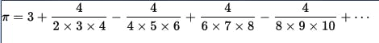

# How to calculate mathematics π

## Taylor's theorem and Taylor series

In this section, we shall consider a polynomial approximation which mimics a function $f$ near one given point. We will seek coefficients $a_0, a_1, \cdots, a_n$ such that the polynomial

$$P_n(x)=a_0+a_1(x-a)+a_2(x-a)^2+\cdots+a_n(x-a)^n+R((x-a)^{n+1})$$

approximates to $f(x)$ near $x=a$, where assuming that $f(x)$ is $nth$ differentiable at $x = a$. Therefore $f(x)\approx P_n(x)$, and we try to choose the coefficients $a_n, n=0,1,2,\cdots,n$.  

The Taylor series of a real or complex-valued function $f(x)$ that is infinitely differentiable at a real or complex number $a$ is the power series

$${\displaystyle f(a)+{\frac {f'(a)}{1!}}(x-a)+{\frac {f''(a)}{2!}}(x-a)^{2}+{\frac {f'''(a)}{3!}}(x-a)^{3}+\cdots ,}$$

where $n!$ denotes the factorial of $n$ and $f^{(n)}(a)$ denotes the $nth$ derivative of $f$ evaluated at the point $a$. In the more compact sigma notation, this can be written as

$${\displaystyle \sum _{n=0}^{\infty }{\frac {f^{(n)}(a)}{n!}}(x-a)^{n}.}$$

The derivative of order zero of $f$ is defined to be $f$ itself and $(x − a)^0$ and $0!$ are both defined to be 1. When $a = 0$, the series is also called a [Maclaurin series][1].

For instance:

The Taylor series for the exponential function $e^x$ at $a = 0$ is

$${\displaystyle {\begin{aligned}\sum _{n=0}^{\infty }{\frac {x^{n}}{n!}}&={\frac {x^{0}}{0!}}+{\frac {x^{1}}{1!}}+{\frac {x^{2}}{2!}}+{\frac {x^{3}}{3!}}+{\frac {x^{4}}{4!}}+{\frac {x^{5}}{5!}}+\cdots \\&=1+x+{\frac {x^{2}}{2}}+{\frac {x^{3}}{6}}+{\frac {x^{4}}{24}}+{\frac {x^{5}}{120}}+\cdots .\end{aligned}}}$$

The above expansion holds because the derivative of $e^x$ with respect to $x$ is also $e^x$ and $e^0$ equals 1. This leaves the terms $(x − 0)^n$ in the numerator and $n!$ in the denominator for each term in the infinite sum.

[1]: https://en.wikipedia.org/wiki/Colin_Maclaurin#Contributions_to_mathematics

## Euler formula: $e^{ix}=cos(x)+i sin(x)$

The Taylor series of function $e^z$ at $a=0$ is

$${\displaystyle {\begin{aligned}e^z&=\sum _{n=0}^{\infty }{\frac {z^{n}}{n!}}\\&={\frac {z^{0}}{0!}}+{\frac {z^{1}}{1!}}+{\frac {z^{2}}{2!}}+{\frac {z^{3}}{3!}}+{\frac {z^{4}}{4!}}+{\frac {z^{5}}{5!}}+\cdots \\&=1+z+{\frac {z^{2}}{2}}+{\frac {z^{3}}{6}}+{\frac {z^{4}}{24}}+{\frac {z^{5}}{120}}+\cdots .\end{aligned}}}$$

 Let $z=ix$,

 left=$e^{ix}=cos(x)+i sin(x)$  
 right=$1+i x-\frac{x^2}{2!}-i \frac{x^3}{3!}+\frac{x^4}{4!}+i \frac{x^5}{5!}-\frac{x^6}{6!}-i \frac{x^7}{7!}+\cdots .$

Therefore

$$cos(x) = 1-\frac{x^2}{2!}+\frac{x^4}{4!}-\frac{x^6}{6!}+\cdots .$$
$$sin(x) = x-\frac{x^3}{3!}+\frac{x^5}{5!}-\frac{x^7}{7!}+\cdots .$$

The above sums are the taylor series summary for function $cos(x)$ and $sin(x)$. (they have the following **Maclaurin series**, for all $x$)

$${\displaystyle {\begin{aligned}cos(x)&=\sum _{n=0}^{\infty }{\frac {(-1)^nx^{2n}}{(2n)!}}\\&={1}-{\frac {x^{2}}{2!}}+{\frac {x^{4}}{4!}}-{\frac {x^{6}}{6!}}+\cdots  .\end{aligned}}}$$

$${\displaystyle {\begin{aligned}sin(x)&=\sum _{n=0}^{\infty }{\frac {(-1)^nx^{2n+1}}{(2n+1)!}}\\&={x}-{\frac {x^{3}}{3!}}+{\frac {x^{5}}{5!}}-{\frac {x^{7}}{7!}}+\cdots  .\end{aligned}}}$$

Of course, we can use Taylor expansion to get the above formula.

$$sin^{(2k)}(x)= \frac{d^{(2k)}sin(x)}{dx}=(-1)^k sin(x), sin^{(2k+1)}(x)=(-1)^k cos(x)$$

The even-th derivative function of $sin(x)$ at $x=0$ equals to 0, and odd-th derivative function of $sin(x)$ at $x=0$ equals to $(-1)^k$  

## Polynomial approximation theorem

How to solve the quation $sin(x)=0$?

1. First, $sin(x)=0$ has the solution $\{kπ，k=0,\pm 1,\pm 2, \cdots .\}$

2. According to the fundamental theorem of algebra (polynomial approximation theorem) , Let's suppose $sin(x)$ is a polynomial.

$$sin(x) \approx c*\prod_{k=1}^{\infty} (kπ-x)(kπ+x)x $$
$$\frac{sin(x)}{x} \approx c*\prod_{k=1}^{\infty} (kπ-x)(kπ+x)$$
Now limit at x tends to 0, we shall get

$$c=\frac{1}{π^2} * \prod_{k=1}^{\infty} \frac {1}{k^2} $$

Therefore we got

$${\displaystyle {\begin{aligned} sin(x) &= x {\prod_{k=1} ^{\infty} ({1- \frac{x}{kπ})} (1+ \frac{x}{kπ})} \\&= x \prod_{k=1} ^{\infty} (1- \frac{x^2}{(kπ)^2}) \end{aligned}}}$$

Let $x = \frac{π}{2}$, we get  

$${\displaystyle {\begin{aligned} \frac{π}{2} &= \prod_{k=1} ^{\infty} \frac{4k^2}{4k^2-1} \\&= \prod_{k=1} ^{\infty} \frac{1}{1- \frac{1}{4k^2}} \\&=\frac{2}{1} \centerdot \frac{2}{3} \centerdot \frac{4}{3} \centerdot \frac{4}{5} \centerdot \frac{6}{5} \centerdot \frac{6}{7} \cdots \\&=\frac{4}{3} \centerdot \frac{16}{15} \centerdot \frac{36}{35} \centerdot \frac{64}{63} \cdots \end{aligned}}}$$

see also [John Wallis product for π](https://en.wikipedia.org/wiki/Wallis_product)

For the same reason,

$${\displaystyle {\begin{aligned}cos(x)&=\prod_{k=1} ^{\infty} {(1 - \frac{2x}{(2k-1)π})} {(1 + \frac{2x}{(2k-1)π})}\\&=x \prod_{k=1} ^{\infty} {(1-\frac{4x^2}{(2k-1)^2 π^2})} \end{aligned}}}$$

## Euler identify

1. From Taylor expansion, we get

$${\displaystyle {\begin{aligned} sin(x)&=x-\frac{x^3}{3!}+\frac{x^5}{5!}+\cdots \end{aligned}}}$$

2. From polynomial approximation theorem and equation solution, we get

$${\displaystyle {\begin{aligned} sin(x)&= x \prod_{k=1} ^{\infty} (1- \frac{x^2}{(kπ)^2})  \end{aligned}}}$$

3. Compare the degree 3 of x-term, we get the coefficients shoulb be equivalent.

$${\displaystyle {\begin{aligned} \frac{1}{3!}&= \sum_{k=1} ^{\infty} \frac{1}{(kπ)^2}  \end{aligned}}}$$

Therefore

$${\displaystyle {\begin{aligned} \frac{π^2}{6}&= \sum_{k=1} ^{\infty} \frac{1}{k^2} &=1+\frac{1}{4}+\frac{1}{9}+\cdots + \frac{1}{n^2}+\cdots \end{aligned}}}$$

## Gregory-Leibniz series

The series for the **inverse tangent** function, which is also known as **Gregory's series**, can be given by:

$${\displaystyle \arctan x=x-{\frac {x^{3}}{3}}+{\frac {x^{5}}{5}}-{\frac {x^{7}}{7}}+\cdots }$$.

The **Leibniz formula** for **π/4** can be obtained by putting $x = 1$ into the above inverse-tangent series.

$$\frac{\pi}{4} = \sum_{n=0}^{\infty}\frac{(-1)^n}{2n+1} = \frac{1}{1}- \frac{1}{3}+ \frac{1}{5}- \frac{1}{7}+ \cdots.$$

As you can see, this converges very slowly, with large, alternating over-estimates and under-estimates.

## Nilakantha Series

$${\displaystyle {\begin{aligned} {\pi} \\&= 3+ \frac{4}{2 \centerdot 3 \centerdot 4}- \frac{4}{4 \centerdot 5 \centerdot 6}+ \frac{4}{6 \centerdot 7 \centerdot 8}- \frac{4}{8 \centerdot 9 \centerdot 10}+ \cdots \\&= 3+ \frac{1}{1 \centerdot 3 \centerdot 2}- \frac{1}{2 \centerdot 5 \centerdot 3}+ \frac{1}{3 \centerdot 7 \centerdot 4}- \frac{1}{4 \centerdot 9 \centerdot 5}+ \cdots \\&= 3+ \sum_{n=2}^{\infty} \frac{(-1)^n}{(n-1)n(2n-1)}  \end{aligned}}}$$
