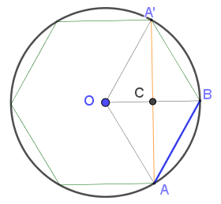

# How to calculate mathematics $π$(圆周率的计算方法)

From [翔文公益数学](https://www.geogebra.org/u/kumath)

## Taylor's theorem and Taylor series

In this section, we shall consider a polynomial approximation which mimics a function $f$ near one given point. We will seek coefficients $a_0, a_1, \cdots, a_n$ such that the polynomial

$P_n(x)=a_0+a_1(x-a)+a_2(x-a)^2+\cdots+a_n(x-a)^n+R((x-a)^{n+1})$

approximates to $f(x)$ near $x=a$, where assuming that $f(x)$ is $nth$ differentiable at $x = a$. Therefore $f(x)\approx P_n(x)$, and we try to choose the coefficients $a_n, n=0,1,2,\cdots,n$.  

The [Taylor series][TS] of a real or complex-valued function $f(x)$ that is infinitely differentiable at a real or complex number $a$ is the power series

$\displaystyle f(a)+{\frac {f'(a)}{1!}}(x-a)+{\frac {f''(a)}{2!}}(x-a)^{2}+{\frac {f'''(a)}{3!}}(x-a)^{3}+\cdots$

where $n!$ denotes the factorial of $n$ and $f^{(n)}(a)$ denotes the $nth$ derivative of $f$ evaluated at the point $a$. In the more compact sigma notation, this can be written as

$泰勒级数f(x)={\displaystyle \sum _{n=0}^{\infty }{\frac {f^{(n)}(a)}{n!}}(x-a)^{n}.}$

The derivative of order zero of $f$ is defined to be $f$ itself and $(x − a)^0$ and $0!$ are both defined to be 1. When $a = 0$, the series is also called a [Maclaurin series][2].

For instance:

The Taylor series for the exponential function $e^x$ at $a = 0$ is

$\displaystyle \begin{aligned}\sum _{n=0}^{\infty }{\frac {x^{n}}{n!}}&={\frac {x^{0}}{0!}}+{\frac {x^{1}}{1!}}+{\frac {x^{2}}{2!}}+{\frac {x^{3}}{3!}}+{\frac {x^{4}}{4!}}+{\frac {x^{5}}{5!}}+\cdots \\&=1+x+{\frac {x^{2}}{2}}+{\frac {x^{3}}{6}}+{\frac {x^{4}}{24}}+{\frac {x^{5}}{120}}+\cdots .\end{aligned}$

The above expansion holds because the derivative of $e^x$ with respect to $x$ is also $e^x$ and $e^0$ equals 1. This leaves the terms $(x − 0)^n$ in the numerator and $n!$ in the denominator for each term in the infinite sum.

[1]: https://en.wikipedia.org/wiki/Colin_Maclaurin#Contributions_to_mathematics

## Euler formula: $e^{ix}=\cos(x)+\text{i}\; \sin(x)$

The Taylor series of function $e^z$ at $a=0$ is

$\displaystyle \begin{aligned}e^z&=\sum _{n=0}^{\infty }{\frac {z^{n}}{n!}}\\&={\frac {z^{0}}{0!}}+{\frac {z^{1}}{1!}}+{\frac {z^{2}}{2!}}+{\frac {z^{3}}{3!}}+{\frac {z^{4}}{4!}}+{\frac {z^{5}}{5!}}+\cdots \\&=1+z+{\frac {z^{2}}{2}}+{\frac {z^{3}}{6}}+{\frac {z^{4}}{24}}+{\frac {z^{5}}{120}}+\cdots .\end{aligned}$

 Let $z=ix$, where $i$ is imaginary unit, which satisfied $i^{4k}=1, i^{4k+1}=i, i^{4k+2}=-1, i^{4k+3}=-i$.

 left side means $\large\red {e^{ix}=\cos(x)+i\;\sin(x)}$    
 right side equals to ${\displaystyle {\begin{aligned} 1+ix-\frac{x^2}{2!}-i \frac{x^3}{3!}+\frac{x^4}{4!}+i \frac{x^5}{5!}-\frac{x^6}{6!}-i \frac{x^7}{7!}+\cdots .\end{aligned}}}$

Therefore

$\displaystyle \red{\cos(x)} = 1-\frac{x^2}{2!}+\frac{x^4}{4!}-\frac{x^6}{6!}+\cdots\\[1em]
\red{\sin(x)} = x-\frac{x^3}{3!}+\frac{x^5}{5!}-\frac{x^7}{7!}+\cdots$

The above sums are the taylor series sum for function **$cos(x)$** and **$sin(x)$**. (they have the following **[Colin Maclaurin series][Maclaurin]**, for all $x$)

$\displaystyle \begin{aligned}\cos(x)&=\sum _{n=0}^{\infty }{\frac {(-1)^nx^{2n}}{(2n)!}}\\&={1}-{\frac {x^{2}}{2!}}+{\frac {x^{4}}{4!}}-{\frac {x^{6}}{6!}}+\cdots  .\end{aligned}$

$\displaystyle \begin{aligned}\sin(x)&=\sum _{n=0}^{\infty }{\frac {(-1)^nx^{2n+1}}{(2n+1)!}}\\&={x}-{\frac {x^{3}}{3!}}+{\frac {x^{5}}{5!}}-{\frac {x^{7}}{7!}}+\cdots  .\end{aligned}$

可见，**$\cos(x)$ 是偶函数，$\sin(x)$ 是奇函数**。   
Of course, we can use Taylor expansion to get the above formula.

$\sin^{(2k)}(x)= \frac{d^{(2k)}\sin(x)}{dx}=(-1)^k \sin(x)\\[1em]
\sin^{(2k+1)}(x)=(-1)^k \cos(x)$

The even-th derivative function of $sin(x)$ at $x=0$ equals to 0, and odd-th derivative function of $sin(x)$ at $x=0$ equals to $(-1)^k$ 

## Polynomial approximation theorem

**Question**: How to solve the quation $sin(x)=0$?

1. First, $\sin(x)=0$ has the solution $\{kπ，k=0,\pm 1,\pm 2, \cdots .\}$

2. According to the fundamental theorem of algebra (polynomial approximation theorem) , Let's suppose $\sin(x)$ is a polynomial.

$\displaystyle \sin(x) = c*\prod_{k=1}^{\infty} (kπ-x)(kπ+x)x \\[1em]\frac{\sin(x)}{x} = c*\prod_{k=1}^{\infty} (kπ-x)(kπ+x)$

Now limit at x tends to 0, we shall get

$\displaystyle c=\prod_{k=1}^{\infty} \frac {1}{k^2π^2}$

Therefore we got

$\displaystyle \begin{aligned} \sin(x) &= x {\prod_{k=1} ^{\infty} ({1- \frac{x}{kπ})} (1+ \frac{x}{kπ})} \\&= x \prod_{k=1} ^{\infty} [1- \frac{x^2}{(kπ)^2}] \end{aligned}$

Let $x = \frac{π}{2}$, we get  

$\displaystyle \begin{aligned} \frac{π}{2} &= \prod_{k=1} ^{\infty} \frac{2k}{2k-1} \centerdot \frac{2k}{2k+1}   \\&= \prod_{k=1} ^{\infty} \frac{1}{1- \frac{1}{4k^2}} \\&=\frac{2}{1} \centerdot \frac{2}{3} \centerdot \frac{4}{3} \centerdot \frac{4}{5} \centerdot \frac{6}{5} \centerdot \frac{6}{7} \cdots \\&=\frac{4}{3} \centerdot \frac{16}{15} \centerdot \frac{36}{35} \centerdot \frac{64}{63} \cdots \end{aligned}$

see also [John Wallis' product for $π$][Wallis]

Similarly, we can get

$\displaystyle \begin{aligned}\cos(x)&=\prod_{k=1} ^{\infty} {(1 - \frac{2x}{(2k-1)π})} {(1 + \frac{2x}{(2k-1)π})}\\&=x \prod_{k=1} ^{\infty} {(1-\frac{4x^2}{(2k-1)^2 π^2})} \end{aligned}$

$\displaystyle \begin{aligned} \tan(x)&=\frac{x}{\frac{\pi}{4}} \centerdot \prod_{k=1} ^{\infty} \frac{1 - \frac{x}{kπ}}{1-\frac{1}{4k}} \centerdot \frac{1 + \frac{x}{kπ}}{1+\frac{1}{4k}}\end{aligned}$

## Euler identity

1. From Taylor expansion, we get   
    $\displaystyle \begin{aligned} \sin(x)&=x-\frac{x^3}{3!}+\frac{x^5}{5!}+\cdots \end{aligned}$
2. From polynomial approximation theorem and equation solution, we get  
    $\displaystyle \begin{aligned} \sin(x)&= x \prod_{k=1} ^{\infty} (1- \frac{x^2}{(kπ)^2})  \end{aligned}$   
3. Compare the degree 3 of x-term, we get the coefficients shoulb be equivalent.    
    $\displaystyle {\begin{aligned} \frac{1}{3!}&= \sum_{k=1} ^{\infty} \frac{1}{(kπ)^2}  \end{aligned}}$   
    Therefore   
    $\displaystyle \begin{aligned} \frac{π^2}{6}&=\sum_{k=1} ^{\infty} \frac{1}{k^2}\\&=1+\frac{1}{4}+\frac{1}{9}+\cdots + \frac{1}{n^2}+\cdots \end{aligned}$   
    **收敛速度还可以接受。**

## Gregory-Leibniz series

The series for the **inverse tangent** function, which is also known as **Gregory's series**, can be given by:  
$\displaystyle \begin{aligned}
    \arctan(x)&=x-\dfrac{x^3}{3}+\dfrac{x^5}{5}-\dfrac{x^7}{7}+\cdots\\&=\sum_{k=0}^\infty(-1)^k\dfrac{x^{2k+1}}{2k+1}
\end{aligned}$    

推导过程如下：  
$\because \dfrac{d(\arctan x)}{dx}=\dfrac{1}{1+x^2}\\$
$\because 1-x^n=(1-x)(1+x+x^2+\cdots+x^{n-1})\\\therefore \dfrac{1}{1-x}=\displaystyle\sum_{n=0}^{\infty} x^n,\;|x|<1\\$
$\dfrac{1}{1+x^2}=\dfrac{1}{1-(-x^2)}=\displaystyle\sum_{n=0}^{\infty}(-x^2)^n=\sum_{n=0}^{\infty}(-1)^nx^{2n}\\$

$\begin{aligned}
    \therefore \arctan(x)&=\int\dfrac{1}{1+x^2}\mathrm{d}x\\
    &=\displaystyle\int\sum_{n=0}^{\infty}(-1)^nx^{2n}\mathrm{d}x\\
    &=\sum_{n=0}^{\infty}(-1)^n\dfrac{x^{2n+1}}{2n+1}, \;|x|<1
\end{aligned}$

The **Leibniz formula** for $\dfrac{π}{4}$ can be obtained by putting $x = 1$ $\red{(TODO?)}$ into the above inverse-tangent series.

$\displaystyle \frac{\pi}{4} = \sum_{n=0}^{\infty}\frac{(-1)^n}{2n+1} = \frac{1}{1}- \frac{1}{3}+ \frac{1}{5}- \frac{1}{7}+ \cdots.$   

As you can see, this converges very slowly(**收敛极慢！不可取**), with large, alternating over-estimates and under-estimates.

## Nilakantha Series

$\displaystyle \begin{aligned} {\pi} &= 3+ \frac{4}{2 \centerdot 3 \centerdot 4}- \frac{4}{4 \centerdot 5 \centerdot 6}+ \frac{4}{6 \centerdot 7 \centerdot 8}- \frac{4}{8 \centerdot 9 \centerdot 10}+ \cdots \\&= 3+ \frac{1}{1 \centerdot 3 \centerdot 2}- \frac{1}{2 \centerdot 5 \centerdot 3}+ \frac{1}{3 \centerdot 7 \centerdot 4}- \frac{1}{4 \centerdot 9 \centerdot 5}+ \cdots \\&= 3+ \sum_{n=2}^{\infty} \frac{(-1)^n}{(n-1)n(2n-1)}  \end{aligned}$

This is the **faster convergent method** for pi.   
**这是计算圆周率的更快一点的收敛方法。**

## Viete's Formula

Viète's formula is the following infinite product of nested radicals representing the mathematical constant $π$:   
$\displaystyle {\frac {2}{\pi }}={\frac {\sqrt {2}}{2}}\cdot {\frac {\sqrt {2+{\sqrt {2}}}}{2}}\cdot {\frac {\sqrt {2+{\sqrt {2+{\sqrt {2}}}}}}{2}}\cdots$   
It is named after François Viète (1540–1603), who published it in 1593. 

Viète's formula may be rewritten and understood as a limit expression.   
$\displaystyle \lim _{n\rightarrow \infty }\prod _{i=1}^{n}{\frac {a_{i}}{2}}={\frac {2}{\pi }}$   
where $a_n = \sqrt{2 + a_{n − 1}}$, with initial condition $a_1 = \sqrt{2}$.

Viète's formula may be obtained as a special case of a formula given more than a century later by Leonhard Euler, who discovered that:    

${\displaystyle {\frac {\sin x}{x}}=\cos {\frac {x}{2}}\cdot \cos {\frac {x}{4}}\cdot \cos {\frac {x}{8}}\cdots }$

Substituting   
${\displaystyle x={\frac {\pi }{2}}}$ in this formula yields:    

${\displaystyle {\frac {2}{\pi }}=\cos {\frac {\pi }{4}}\cdot \cos {\frac {\pi }{8}}\cdot \cos {\frac {\pi }{16}}\cdots}$

Then, expressing each term of the product on the right as a function of earlier terms using the half-angle formula:   

${\displaystyle \cos {\frac {x}{2}}={\sqrt {\frac {1+\cos x}{2}}}}$   

gives Viète's formula.

It is also possible to derive from Viète's formula a related formula for $π$ that still involves nested square roots of two, but uses only one multiplication: [ref Viete formula][Viete]

$\displaystyle \pi =\lim _{k\to \infty }2^{k}\underbrace {\sqrt {2-{\sqrt {2+{\sqrt {2+{\sqrt {2+{\sqrt {2+\cdots +{\sqrt {2}}}}}}}}}}}} _{k\ \mathrm {square \;roots}}$

## 反三角函数 $\arcsin(x)$

$\dfrac{d}{dx}(\sin^{-1}x)=\dfrac{1}{\sqrt{1-x^2}}\\$

$\begin{aligned}
\implies \displaystyle \sin^{-1}x &=\int(1-x^2)^{-1/2}\mathrm{d}x+c(constant)\\
&=\int(1+\dfrac{x^2}{2}+\dfrac{3x^4}{8}+\dfrac{5x^6}{16}+\cdots+c),\;|x|<1\\
&=x+\dfrac{1}{2}\dfrac{x^3}{3}+\dfrac{1\cdot3}{2\cdot4}\dfrac{x^5}{5}+\dfrac{1\cdot3\cdot5}{2\cdot4\cdot6}\dfrac{x^7}{7}+\cdots+c    
\end{aligned}$

$\because \sin^{-1}x=0 at x=0\implies c=0\\$

$\therefore \sin^{-1}(x)=x+\dfrac{1}{2}\dfrac{x^3}{3}+\dfrac{1\cdot3}{2\cdot4}\dfrac{x^5}{5}+\dfrac{1\cdot3\cdot5}{2\cdot4\cdot6}\dfrac{x^7}{7}+\cdots,\;|x|<1\\
=\displaystyle \sum_{n=0}^{\infty}\dfrac{(2n)!}{2^{2n}(n!)^2(2n+1)}x^{2n+1}$

同理可以得到    
$\therefore \cos^{-1}(x)=\dfrac{\pi}{2}-\left(x+\dfrac{1}{2}\dfrac{x^3}{3}+\dfrac{1\cdot3}{2\cdot4}\dfrac{x^5}{5}+\dfrac{1\cdot3\cdot5}{2\cdot4\cdot6}\dfrac{x^7}{7}+\cdots\right),\;|x|<1\\
=\displaystyle \dfrac{\pi}{2}-\sum_{n=0}^{\infty}\dfrac{(2n)!}{2^{2n}(n!)^2(2n+1)}x^{2n+1}$

## Taylor级数和Maclaurin Series的实现

在GeoGebra中可以轻松实现多项式之和逼近各种函数。

1. 先定义次数Order的滑条 $n=slider(1,20,1)$
2. 再定义要逼近的函数，如 $f(x)=\arctan(x),g(x)=\sin(x),h(x)=\cos(x),\cdots$
3. 调用函数 $g=TaylorPolinomial(f,x(A),n),\;A=(0,0)$
4. 调用函数 $FormulaText(g, true, true)$ 可以显示级数

[TaylorSeries的多项式逼近演示GGB](ggb/TaylorSeries的多项式逼近演示.ggb)

## 计算 $\pi$ 收敛速度极快算法

代数和几何结合的方法。

采用刘徽割圆术，用正n边形逼近圆的方法，实现计算圆周率 $\pi$ 的目的。

记 正n边形的边长为 $L_n$, 由正n边形产生的正 2n 边形的边长为 $L_{2n}$, 则如图可有    
   
$L_n=AA',L_{2n}=AB\\
L_{2n}^2=(\dfrac{L_n}{2})^2+(1-OC)^2\\
=\dfrac{1}{4}L_n^2+\left(1-\sqrt{1-\dfrac{1}{4}L_n^2}\right)^2\\
=2-2\sqrt{1-\dfrac{1}{4}L_n^2}\\
L_{2n}=\sqrt{2-\sqrt{4-L_n^2}}$

假定圆的半径$r=1$, 则有正6边形的边长 $L_6=1$, 利用迭代关系式可以快速求出周长    
$\displaystyle C_{O}=2\pi=\lim_{n\to \infin} (n\times L_{n})\\
\pi=\dfrac{1}{2}\times \lim_{n\to \infin} (n \times L_{n})\\$

上述算法收敛性很快！

在GeoGebra中实现起来也很方便。

1. 先建立迭代次数滑动条 $n=slider(1,10,1)$
2. 再建立迭代函数 $f(x)=sqrt(2 - sqrt(4 - x x))$
3. 然后用GGB的迭代命令 $value = Iteration(f, 1, n)\to$ $L_{2n}=\sqrt{2-\sqrt{4-L_n\times L_n}},L_6=1$，初始值取正6边形时的值1.
4. 正2n边形的半周长为 $\pi=value\times6\times2^{n-1}$

这一算法的收敛也极快，正多边形的边数以指数级增长。$边数=6\times2^{n-1}$

[Viete]:https://en.wikipedia.org/wiki/Viète%27s_formula#cite_note-servi-12
[TS]:https://en.wikipedia.org/wiki/Taylor_series
[Maclaurin]:https://en.wikipedia.org/wiki/Colin_Maclaurin
[Wallis]:https://en.wikipedia.org/wiki/Wallis_product